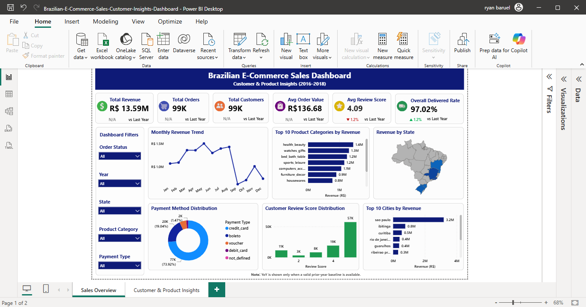
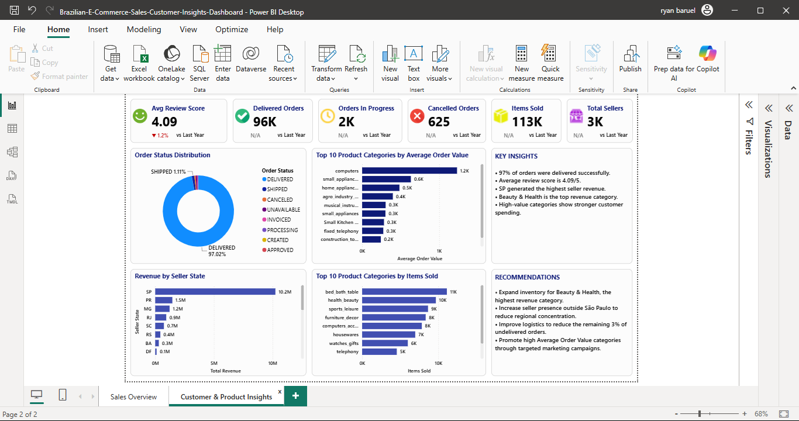

# Brazilian E-Commerce Sales Analytics

Data analysis and visualization project using Power BI, focused on **sales performance, customer behavior, product categories, payment methods, and seller performance**.

## Project Overview

This project analyzes Brazilian e-commerce transactions to identify business trends and performance patterns across sales, customers, products, orders, and sellers.

The project demonstrates an end-to-end data analytics workflow, from data cleaning and transformation to SQL analysis, data modeling, and interactive Power BI dashboard development.

## Business Objectives

- Analyze revenue and order trends over time
- Identify top-performing product categories and sellers
- Understand customer distribution and purchasing behavior
- Analyze payment method usage
- Evaluate order and sales performance
- Identify trends and patterns that can support business decision-making

## Tools & Technologies

- **SQL Server** – Data cleaning, transformation, validation, and analysis
- **Microsoft Excel** – Data preparation and validation
- **Power BI** – Data modeling, DAX, visualization, and dashboard development
- **Power Query** – Data transformation and preparation
- **DAX** – KPI calculations, trend analysis, and business metrics

## Data Preparation

The dataset was prepared through several data cleaning and validation steps, including:

- Standardizing data types and formats
- Cleaning customer and product information
- Handling missing and inconsistent values
- Standardizing product category names
- Validating relationships between datasets
- Preparing data for analysis and visualization

### SQL Analysis

The data cleaning, transformation, validation, and analysis steps were performed using Microsoft SQL Server.

[View the SQL analysis script](sql/brazilian_ecommerce_analysis.sql)

## Dashboard

### Sales Overview

The Sales Overview dashboard provides an overview of key sales and order performance indicators, including revenue trends, product performance, and seller performance.

### Customer & Product Insights

The Customer & Product Insights dashboard provides additional analysis of customer distribution, product categories, payment methods, and other business performance indicators.

## Key Insights

The analysis focuses on identifying:

- Revenue and order trends across different periods
- Top-performing product categories
- Top sellers by revenue
- Customer distribution across Brazilian states
- Payment method distribution
- Product and customer performance patterns

## Skills Demonstrated

- Data Cleaning & Transformation
- SQL Data Analysis
- Data Validation
- Data Modeling
- DAX
- Power BI Dashboard Development
- KPI Design & Development
- Trend Analysis
- Business Intelligence
- Data Visualization
- Business Insights

## Project Status

**Completed – Portfolio Project**

This project was developed as part of my hands-on data analytics portfolio to demonstrate practical skills in **SQL, Excel, Power BI, data modeling, and business analysis**.
